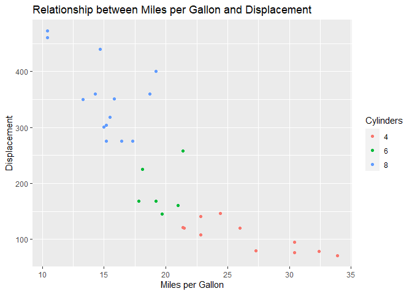

<!-- README.md is generated from README.Rmd. Please edit that file -->

# plotutils

<!-- badges: start -->
<!-- badges: end -->

This package provides a function to set a custom ggplot2 theme and adds
the Barlow font.

Much of the code stems from [Long Nguyen](https://github.com/long39ng)
with whom I worked on a collaborative project for [CorrelAid
e.V.](https://correlaid.org/).

## Installation

You can install the development version from
[GitHub](https://github.com/) with:

``` r
# install.packages("devtools")
devtools::install_github("L-Groeninger/plotutils")
```

## Example

This is a basic example which first shows you how plots look without the
custom theme:

``` r
library(ggplot2)

example_plot <- ggplot(mtcars, aes(x = mpg, y = disp, 
                                   colour = as.factor(cyl))) +
  geom_point() +
  labs(title = "Relationship between Miles per Gallon and displacement",
       x = "Miles per Gallon",
       y = "Displacement",
       colour = "Cylinders")

example_plot
```



Now we can set the custom theme for our plots to have our desired font
and a cleaner look. Additionally the position of the legend is moved up.

``` r
# Set the custom theme globally.
plotutils::set_custom_theme()

example_plot
```


